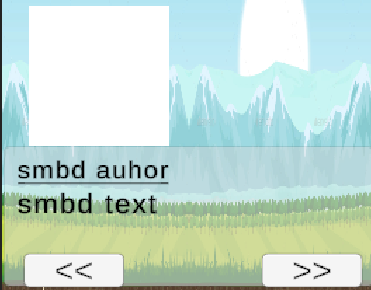
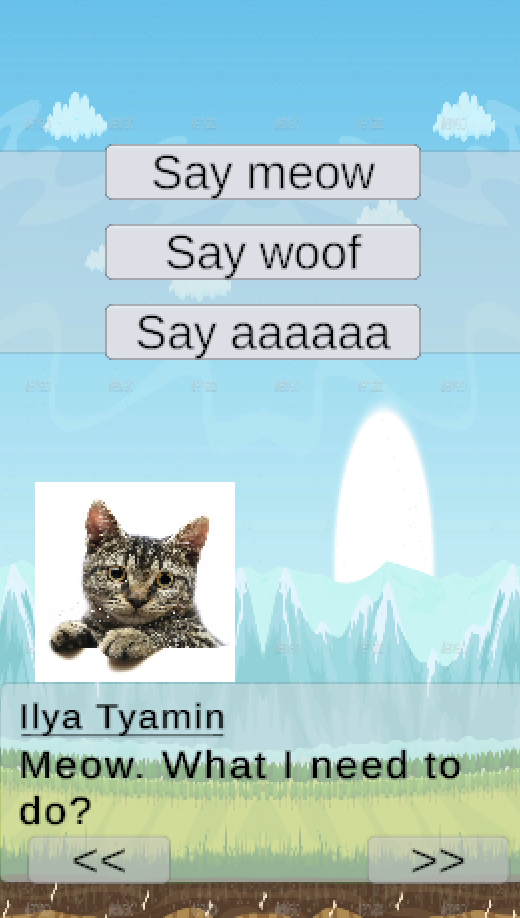

# Система управления диалогами
Выполнил Тямин Илья
## О разработанном решении
Разработанное решение представляет собой полноценную систему диалогов, представляющую себя набор "сюжетных линий", взаимодействующих между собой. Текущая реплика сюжетной линии представлена двумя видами событий:
- обычный диалог без выбора ответа и разветвлений сюжетной линии
- выбор ответа среди предложенных и разветвление сюжетной линии

> Стоит отметить, что в моем решении количество вариантов ответа неограничено и настраивается пользователем.

## Как все устроено?
### Визуальная часть
Текст отображается в специально настроенном окне. Также к каждой реплике прикреплен персонаж, от чьего имени ведется речь. Вместе с именем персонажа, отоброжается также и его изображение (спрайт).

В случае, если пользователь дошел до варианта с выбором сюжетной линии, то соответствующие кнопки выбора отобразятся сверху. В данном случае, у пользователя выбор из трех. Вовремя реплик с выбором сюжетной части, пролистывание влево и вправо запрещено, оно станет доступным только после выбора кнопки. Во время реплик без выбора ответов, данная панель не отображается.

### Техническая часть
Пользователь должен указать изначальный диалог в скрипте DialogueManager. Все диалоги (`DialogueStory`) являются `ScriptableObject`, благодаря которым возможно сохранить их как файл не на сцене. Пользователь может настроить каждый диалог в инспекторе, выбрать тип вопроса: с выбором сюжетной линии или нет, в случае выбора с союжетной линией должен выбрать ответы. Каждый ответ состоит из текста, а также или из индекса реплики в текущей сюжетной линии, или из ссылка на новую сюжетную линию (в этом плане решение масштабируемо). 

Программа тщательно следит за выходом за границы и исключает крайние случаи. Выйти за предел диалога невозможно: программа следит что мы достигли левой границы сюжетной линии или, наоборот, самой правой. 

При выборе вопроса с сюжетной линией пользователю доступно неограниченное количество выборов (разумеется, главное, чтобы они поместились на экран). Это достигается засчет того, что кнопки "спавнятся" в скрипте `ChoiceManager`, а не заранее заготовлены на сцене.  После выбора, кнопки исчезают вместе в панелью.

Также воспроизводится анимация печатания текста. Каждая буква печатается, как в реальном мире, c разной скоростью, чтобы процесс печатания был реалистичным (от 0.01 до 0.15 секунды). Анимацию можно отключить, просто отключив ее в `DialogueManager`. На время анимации, кнопки перехода также отключены, чтобы не возник баг с текстом.
